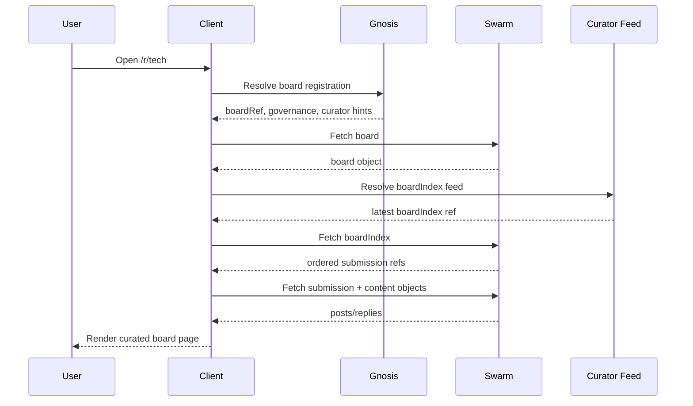
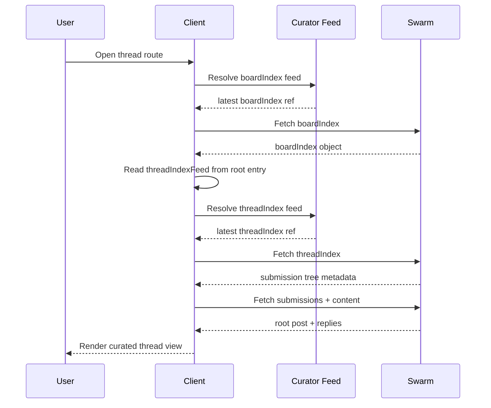
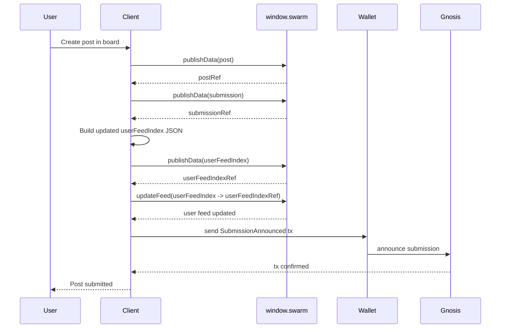
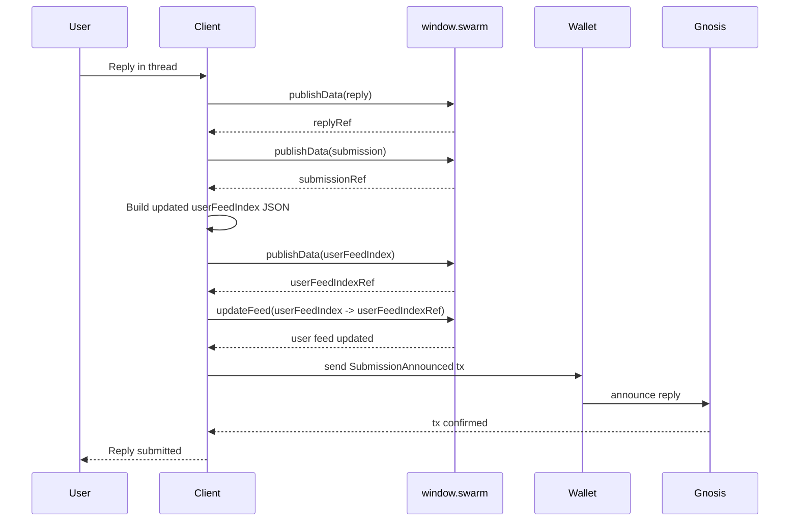

# Swarm Message Board Protocol v1 Spec

Date: 2026-03-23
Status: Draft

This document is the normative v1 protocol spec for a Reddit-like message board built on top of:

- Swarm for immutable content storage
- Swarm feeds for mutable curated views
- Gnosis Chain for public coordination and discovery

It is a companion to [swarm-message-board-protocol-sketch.md](/Users/florian/Git/freedom-dev/freedom-browser/docs/swarm-message-board-protocol-sketch.md), which remains the rationale and design-history document. This file is implementation-oriented and aims to define the minimum interoperable v1 protocol.

## 1. Scope

This v1 spec defines:

- canonical protocol objects
- minimal on-chain events and responsibilities
- curator-scoped feed-backed views
- client read and write flows
- validation rules and protocol invariants

This v1 spec does not define:

- moderation policy
- ranking algorithms
- anti-spam economics
- DAO governance internals
- binary media formats beyond general attachment support
- private content or encrypted feeds

## 2. Normative Language

The key words "MUST", "MUST NOT", "SHOULD", "SHOULD NOT", and "MAY" in this document are to be interpreted as normative requirements.

## 3. Design Principles

1. Immutable content MUST live on Swarm.
2. Every submission MUST be announced on Gnosis Chain.
3. End-user clients SHOULD read curated feed-backed views by default.
4. The raw on-chain submission log is primarily for curators, indexers, and advanced tooling, not the dominant end-user read path.
5. There is no single mandatory curator. Users MAY choose among competing curators.
6. Board identity MUST be distinct from board front-page state.
7. Moderation in v1 is expressed through omission, labels, ordering, and hidden lists, not deletion of immutable content.

## 4. Protocol Layers

### 4.1 Swarm

Swarm stores:

- immutable protocol objects
- curator profiles
- board metadata
- feed-backed mutable indexes

### 4.2 Swarm Feeds

Feeds provide stable mutable entrypoints for:

- `userFeedIndex`
- `boardIndex`
- `threadIndex`
- `globalIndex`

### 4.3 Gnosis Chain

Gnosis provides:

- public board registration
- public submission announcements
- curator discovery
- optional governance and moderation signals

## 5. Core Actors

### 5.1 Author

A user who publishes immutable content and submits it into one or more boards.

### 5.2 Curator

A user, service, agent, multisig, or DAO-controlled process that watches the on-chain submission log and publishes feed-backed views.

### 5.3 Board Governance

The authority associated with a board identity. Governance MAY endorse curators, update board metadata, and publish moderation policy.

### 5.4 Client

A user-facing application such as Swarmit. Clients read curated views, display immutable content, and help users publish and announce submissions.

### 5.5 Indexer

A process that watches chain events, fetches Swarm objects, and materializes derived state. Curators typically operate indexers.

## 6. Freedom Browser Assumptions

This v1 spec assumes the browser/runtime provides:

- immutable publish via `window.swarm.publishData()` and `window.swarm.publishFiles()`
- stable feed creation and update via `window.swarm.createFeed()` and `window.swarm.updateFeed()`
- Gnosis transaction capability via a wallet provider such as `window.ethereum`

The protocol is not tied to Freedom Browser in principle, but this capability set is the intended v1 implementation substrate.

Important implementation note:

- In the intended Freedom-based deployment, author-owned feeds are naturally created through `window.swarm`.
- Curator-owned feeds are protocol objects too, but are expected to be created and updated by curator infrastructure outside the page-facing browser provider, typically through bee-js or an equivalent privileged integration.
- The protocol does not require any specific provider-level feed naming scheme. Interoperability depends on stable feed-manifest references, not on how a particular client derives internal feed names or topics.

## 7. Canonical Object Types

All protocol objects MUST include a `protocol` field with an explicit versioned type identifier.

### 7.1 `board`

Purpose:

- defines the identity and metadata of a subreddit-like community

Storage:

- immutable Swarm object

Required fields:

- `protocol`
- `boardId`
- `slug`
- `title`
- `description`
- `createdAt`
- `governance`

Optional fields:

- `rulesRef`
- `endorsedCurators`
- `defaultCurator`
- `metadata`

Example:

```json
{
  "protocol": "freedom-board/board/v1",
  "boardId": "tech",
  "slug": "tech",
  "title": "Technology",
  "description": "Posts about software, hardware, and networks",
  "createdAt": 1773792000000,
  "governance": {
    "chainId": 100,
    "type": "safe",
    "address": "0xBoardSafe"
  },
  "rulesRef": "bzz://RULES_REF",
  "endorsedCurators": [
    "0xCuratorA"
  ],
  "defaultCurator": "0xCuratorA"
}
```

### 7.2 `post`

Purpose:

- immutable top-level content payload

Storage:

- immutable Swarm object

Required fields:

- `protocol`
- `author`
- `title`
- `body`
- `createdAt`

Optional fields:

- `attachments`

Attachment descriptor v1 schema:

- `reference` (required) — `bzz://` Swarm reference to separately published immutable attachment content
- `contentType` (required)
- `name` (optional)
- `sizeBytes` (optional)
- `kind` (optional)
- `caption` (optional)
- `altText` (optional)

`kind` is a UI hint, not the canonical technical type. Clients SHOULD tolerate unknown values.

Recommended v1 vocabulary:

- `image`
- `video`
- `audio`
- `file`
- `link`

Example:

```json
{
  "protocol": "freedom-board/post/v1",
  "author": {
    "address": "0xAuthor",
    "userFeed": "bzz://USER_FEED_MANIFEST_REF"
  },
  "title": "Hello Swarm",
  "body": {
    "kind": "markdown",
    "text": "First post"
  },
  "attachments": [],
  "createdAt": 1773792000000
}
```

### 7.3 `reply`

Purpose:

- immutable reply payload

Storage:

- immutable Swarm object

Required fields:

- `protocol`
- `author`
- `body`
- `createdAt`

Notes:

- v1 places thread-placement relationships in `submission`, not in `reply`.

Example:

```json
{
  "protocol": "freedom-board/reply/v1",
  "author": {
    "address": "0xAuthor",
    "userFeed": "bzz://USER_FEED_MANIFEST_REF"
  },
  "body": {
    "kind": "markdown",
    "text": "Interesting point"
  },
  "createdAt": 1773792060000
}
```

### 7.4 `submission`

Purpose:

- canonical protocol object that places content into a board
- canonical object announced on-chain

Storage:

- immutable Swarm object

Required fields:

- `protocol`
- `boardId`
- `kind`
- `contentRef`
- `author`
- `createdAt`

Conditional fields:

- `parentSubmissionId` is REQUIRED for replies
- `rootSubmissionId` is REQUIRED for replies

Optional fields:

- `flair`
- `metadata`

Identity note:

- the canonical `submissionId` is the immutable `submission` object's normalized Swarm reference
- because that reference is only known after publication, the immutable `submission` object does NOT embed a `submissionId` field inside itself
- off-chain references to submissions such as `submissionId`, `parentSubmissionId`, and `rootSubmissionId` MUST use normalized `bzz://<hex>` form

Rules:

- `kind` MUST be `post` or `reply`
- `contentRef` MUST point to a matching immutable object type

Example:

```json
{
  "protocol": "freedom-board/submission/v1",
  "boardId": "tech",
  "kind": "reply",
  "contentRef": "bzz://REPLY_REF",
  "parentSubmissionId": "bzz://PARENT_SUBMISSION_REF",
  "rootSubmissionId": "bzz://ROOT_SUBMISSION_REF",
  "author": {
    "address": "0xAuthor",
    "userFeed": "bzz://USER_FEED_MANIFEST_REF"
  },
  "createdAt": 1773792060000
}
```

### 7.5 `userFeedIndex`

Purpose:

- author-owned mutable activity log

Storage:

- Swarm feed-backed mutable object

Required fields:

- `protocol`
- `author`
- `updatedAt`
- `entries`

Each entry MUST contain:

- `submissionId`
- `submissionRef`
- `boardId`
- `kind`
- `createdAt`

Example:

```json
{
  "protocol": "freedom-board/user-feed/v1",
  "author": "0xAuthor",
  "updatedAt": 1773792120000,
  "entries": [
    {
      "submissionId": "bzz://SUBMISSION_REF",
      "submissionRef": "bzz://SUBMISSION_REF",
      "boardId": "tech",
      "kind": "reply",
      "createdAt": 1773792060000
    }
  ]
}
```

Operational note:

- `userFeedIndex` is a mutable object, but the feed itself only points to an immutable content reference.
- Updating `userFeedIndex` therefore requires two steps:
  1. publish the updated `userFeedIndex` object as immutable content
  2. update the feed to point at the new immutable reference

### 7.6 `boardIndex`

Purpose:

- curator-authored board front page

Storage:

- Swarm feed-backed mutable object

Identity:

- unique per `(boardId, curator)`

Required fields:

- `protocol`
- `boardId`
- `curator`
- `updatedAt`
- `entries`

Optional fields:

- `hidden`
- `labels`

Each entry MUST contain:

- `submissionId`
- `submissionRef`

Optional entry fields:

- `rank`
- `labels`
- `threadIndexFeed`

`threadIndexFeed`, if present, MUST be a stable feed-manifest `bzz://` URL for the chosen curator's `threadIndex` of that top-level submission. It is primarily relevant for top-level post entries, not replies.

Example:

```json
{
  "protocol": "freedom-board/board-index/v1",
  "boardId": "tech",
  "curator": "0xCuratorA",
  "updatedAt": 1773792180000,
  "entries": [
    {
      "submissionId": "bzz://SUB1_REF",
      "submissionRef": "bzz://SUB1_REF",
      "threadIndexFeed": "bzz://THREAD1_FEED_MANIFEST_REF",
      "rank": 1,
      "labels": ["hot"]
    }
  ],
  "hidden": [
    {
      "submissionId": "bzz://SUB2_REF",
      "reason": "spam"
    }
  ]
}
```

### 7.7 `threadIndex`

Purpose:

- curator-authored materialized thread view

Storage:

- Swarm feed-backed mutable object

Identity:

- unique per `(rootSubmissionId, curator)`

Discovery:

- clients discover a curator's `threadIndex` feed for a thread from the matching top-level `boardIndex` entry's `threadIndexFeed`
- `threadIndexFeed` SHOULD be a stable feed-manifest URL so later thread updates do not require changing the thread route itself

Required fields:

- `protocol`
- `rootSubmissionId`
- `curator`
- `updatedAt`
- `nodes`

Each node MUST contain:

- `submissionId`
- `parentSubmissionId`
- `depth`

Example:

```json
{
  "protocol": "freedom-board/thread-index/v1",
  "rootSubmissionId": "bzz://ROOT_SUBMISSION_REF",
  "curator": "0xCuratorA",
  "updatedAt": 1773792240000,
  "nodes": [
    {
      "submissionId": "bzz://ROOT_SUBMISSION_REF",
      "parentSubmissionId": null,
      "depth": 0
    },
    {
      "submissionId": "bzz://REPLY1_SUBMISSION_REF",
      "parentSubmissionId": "bzz://ROOT_SUBMISSION_REF",
      "depth": 1
    }
  ],
  "hidden": []
}
```

### 7.8 `globalIndex`

Purpose:

- curator-authored cross-board front page

Storage:

- Swarm feed-backed mutable object

Identity:

- unique per curator

Required fields:

- `protocol`
- `curator`
- `updatedAt`
- `entries`

Each entry MUST contain:

- `boardId`
- `submissionId`
- `submissionRef`

Example:

```json
{
  "protocol": "freedom-board/global-index/v1",
  "curator": "0xCuratorA",
  "updatedAt": 1773792300000,
  "entries": [
    {
      "boardId": "tech",
      "submissionId": "bzz://SUB1_REF",
      "submissionRef": "bzz://SUB1_REF",
      "rank": 1
    }
  ]
}
```

### 7.9 `curatorProfile`

Purpose:

- describes a curator identity and its published feeds

Storage:

- immutable Swarm object in v1

Required fields:

- `protocol`
- `curator`
- `name`
- `description`
- `globalIndexFeed`

Optional fields:

- `policyRef`
- `boardFeeds`

Operational note:

- In v1, `curatorProfile` is intentionally immutable.
- Updating a curator profile means publishing a new immutable profile object and emitting a fresh `CuratorDeclared` event.
- Later protocol versions MAY introduce a stable feed-backed curator profile, but v1 does not require it.

Example:

```json
{
  "protocol": "freedom-board/curator/v1",
  "curator": "0xCuratorA",
  "name": "Chronological Curator",
  "description": "Spam-filtered chronological board views",
  "policyRef": "bzz://POLICY_REF",
  "globalIndexFeed": "bzz://GLOBAL_INDEX_FEED_MANIFEST_REF",
  "boardFeeds": {
    "tech": "bzz://TECH_BOARD_FEED_MANIFEST_REF"
  }
}
```

## 7.10 Stable Feed Manifest References

Feed-backed objects are read through stable feed-manifest `bzz://` URLs.

This means:

- the feed manifest reference itself is stable
- the content resolved by that reference changes over time
- stable feed-manifest URLs MAY be embedded in immutable objects without becoming stale

For example:

- `author.userFeed` in a `post` or `reply` SHOULD be the stable feed-manifest URL for that author's `userFeedIndex`
- `curatorProfile.globalIndexFeed` and `curatorProfile.boardFeeds` SHOULD be stable feed-manifest URLs

## 8. On-Chain Surface

## 8.1 Core Principle

Every `submission` MUST be announced on-chain.

The on-chain submission log exists primarily so curators and indexers can:

- discover new content
- derive neutral ordering
- build competing views

Clients MAY expose raw announced content in the future, but end-user read flows SHOULD default to curated views.

## 8.2 Minimal Events

The minimum useful on-chain protocol surface is:

```solidity
event BoardRegistered(
  bytes32 indexed boardId,
  string slug,
  string boardRef,
  address governance
);

event BoardMetadataUpdated(
  bytes32 indexed boardId,
  string boardRef
);

event SubmissionAnnounced(
  bytes32 indexed boardId,
  bytes32 indexed submissionId,
  string submissionRef,
  bytes32 parentSubmissionId,
  bytes32 rootSubmissionId,
  address author
);

event CuratorDeclared(
  address indexed curator,
  string curatorProfileRef
);
```

`ModerationDecision` and richer governance events MAY be added later, but they are not required for v1 interoperability.

## 8.3 Contract Responsibilities

The v1 contract surface MUST support:

- board registration
- board metadata updates
- submission announcement
- curator declaration

The v1 contract surface SHOULD NOT attempt to store:

- post bodies
- replies
- ranking state
- full moderation state

## 9. Feed Ownership Model

### 9.1 Author-Owned Feeds

Authors SHOULD own and update:

- `userFeedIndex`

In the intended Freedom-based implementation, these are the feeds most naturally created and updated through `window.swarm`.

### 9.2 Curator-Owned Feeds

Curators SHOULD own and update:

- `boardIndex`
- `threadIndex`
- `globalIndex`

In the normal deployment model, curator-owned feeds are infrastructure-owned feeds maintained by curator/indexer processes, not by arbitrary browser pages.

### 9.3 Governance-Endorsed Feeds

Boards MAY endorse one or more curator-owned feeds, but board governance does not create canonical truth for all users.

## 10. Client Read Flows

## 10.1 Board Page Load

Given a route such as `/r/tech`, a compliant client SHOULD:

1. load the application shell
2. resolve board identity from chain
3. fetch the immutable `board` object from Swarm
4. select a curator
5. resolve the curator's `boardIndex` feed
6. fetch the latest `boardIndex`
7. fetch each referenced `submission`
8. fetch each referenced `post` or `reply`
9. render the board view

Recommended curator selection order:

1. user-selected curator preference
2. `board.defaultCurator`, if present and usable
3. the only endorsed curator, if exactly one exists and is usable
4. explicit user choice

If a selected or default curator has unavailable, empty, or unresolved feeds, the client SHOULD fall through to the next option rather than rendering a blank board by default.

Client UX guidance:

- clients SHOULD make the active curator visible
- clients SHOULD allow switching curators
- clients SHOULD persist curator preference per board when the user explicitly chooses one



## 10.2 Thread Page Load

Given a route such as `/r/tech/comments/<rootSubmissionId>`, a compliant client SHOULD:

1. load the application shell
2. select a curator
3. resolve the curator's `boardIndex` feed
4. fetch the latest `boardIndex`
5. locate the root submission entry and read its `threadIndexFeed`
6. resolve that `threadIndex` feed
7. fetch the latest `threadIndex`
8. fetch each referenced `submission`
9. fetch each referenced immutable content object
10. render the materialized reply tree



## 11. Client Write Flows

## 11.1 Create Post

A compliant client creating a top-level post MUST:

1. publish the immutable `post` object to Swarm
2. publish the immutable `submission` object to Swarm
3. materialize the updated `userFeedIndex` object in memory
4. publish the updated `userFeedIndex` object to Swarm
5. update the author's `userFeedIndex` feed to the new immutable reference
6. announce the `submission` on-chain



## 11.2 Create Reply

A compliant client creating a reply MUST:

1. publish the immutable `reply` object to Swarm
2. publish the immutable `submission` object containing `parentSubmissionId` and `rootSubmissionId`
3. materialize the updated `userFeedIndex` object in memory
4. publish the updated `userFeedIndex` object to Swarm
5. update the author's `userFeedIndex` feed to the new immutable reference
6. announce the `submission` on-chain



Operational note:

- After a feed update, the stable feed-manifest `bzz://` URL MAY briefly resolve to stale content or 404 while the new SOC update propagates through the network.
- v1 clients SHOULD handle this gracefully by retrying, showing the last known view while fetching the latest one, or indicating that the newest state is still propagating.

## 12. Curator Responsibilities

A curator implementing v1 SHOULD:

1. watch `SubmissionAnnounced` events for relevant boards
2. fetch each referenced `submission` object
3. fetch referenced immutable content objects
4. apply its ranking and moderation policy
5. publish updated `boardIndex`, `threadIndex`, and optionally `globalIndex`

Curators MUST NOT modify immutable content. They MAY:

- include content
- omit content
- reorder content
- label content
- mark content hidden in their own indexes

In v1, moderation metadata SHOULD live in curator-owned Swarm objects rather than on-chain.

## 13. Validation Rules

### 13.1 General

- Every protocol object MUST contain a `protocol` field.
- Timestamp fields MUST use Unix epoch milliseconds.
- References SHOULD be normalized as `bzz://<hex>`.

### 13.2 Submission Rules

- `submission.kind = post` MUST NOT include `parentSubmissionId`.
- `submission.kind = reply` MUST include both `parentSubmissionId` and `rootSubmissionId`.
- `submission.boardId` MUST reference an existing board.
- `submission.contentRef` MUST match the declared `kind`.
- the canonical `submissionId` is the immutable `submission` object's normalized Swarm reference.
- the immutable `submission` object itself MUST NOT embed a `submissionId` field.
- off-chain `submissionId`, `parentSubmissionId`, and `rootSubmissionId` values MUST use normalized `bzz://<hex>` form.

### 13.3 Feed Rules

- `userFeedIndex.author` MUST match the publishing identity controlling that feed.
- `boardIndex.curator`, `threadIndex.curator`, and `globalIndex.curator` MUST match the publishing identity controlling those feeds.
- `threadIndex.rootSubmissionId` MUST refer to a top-level post submission.

### 13.4 Board Rules

- `board.slug` SHOULD be URL-safe.
- `board.boardId` MUST be stable over time.
- `boardId` and `slug` SHOULD match in v1 unless there is a strong migration reason not to.

## 14. Versioning

v1 protocol identifiers MUST use the `freedom-board/.../v1` namespace.

Examples:

- `freedom-board/post/v1`
- `freedom-board/submission/v1`
- `freedom-board/thread-index/v1`

Future incompatible changes MUST increment the type version rather than mutating v1 semantics in place.

## 15. Security and Abuse Assumptions

v1 explicitly assumes:

- spam resistance is not fully solved
- censorship resistance comes from public submission announcements plus competing curators
- durability depends on Swarm storage economics and stewardship
- raw chain announcements are not a sufficient UX layer by themselves

Recommended v1 product stance:

- show curated views by default
- make curator choice visible
- treat chain announcements as the discovery substrate, not the primary reading surface

## 16. Open Decisions Before Implementation

There are no additional protocol blockers for v1 in this document.

Explicitly deferred beyond v1:

1. feed-backed `curatorProfile` updates
2. on-chain moderation signals or attestation systems
3. richer attachment semantics beyond the minimal v1 descriptor schema
4. more advanced curator-discovery and curator-selection UX conventions

## 17. Implementation Order

Suggested implementation order for a Swarmit v1:

1. finalize object schemas
2. finalize Gnosis event schema
3. build board registration + submission announcement contracts
4. build author publishing flow on top of `window.swarm` + wallet txs
5. build a first curator/indexer
6. build read-path clients for board and thread views
7. add curator switching and profile discovery

## 18. Summary

Swarm Message Board Protocol v1 is based on three linked ideas:

- immutable user content on Swarm
- mandatory on-chain submission announcements on Gnosis
- mutable curator-scoped views via Swarm feeds

This creates a system where:

- users own their authored content
- curators compete on ranking and moderation
- boards remain distinct protocol identities
- clients can default to curated UX without depending on one mandatory operator
